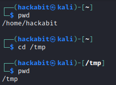
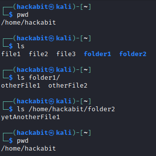
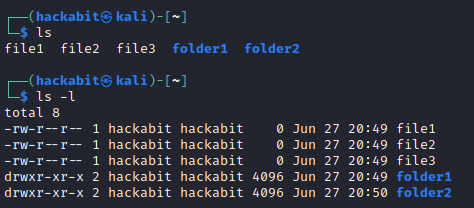
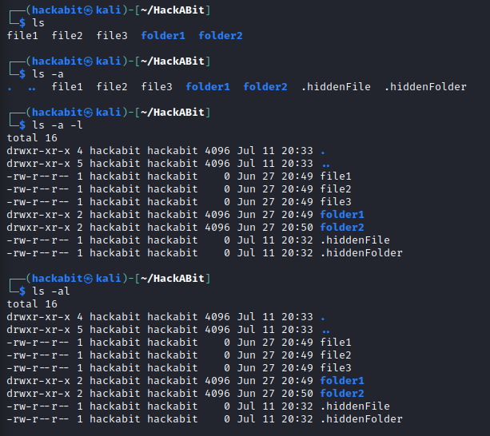
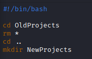
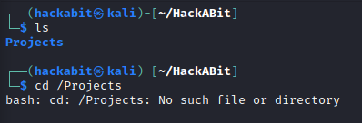

# [System Administration] Linux Navigation
*How to get around using the Linux command line.*

# Objectives
- Figure out where you are using `pwd`. 
- Navigate somewhere else using `cd`.
- Find other files and folders using the `ls` command.

# Introduction
The Linux command line may seem daunting to some, but it's much easier than it looks.  It only takes a few basic commands to find your way around the entire Linux filesystem. With time and practice, you may even start to prefer using the command line instead of the GUI, as there are many benefits! 

1. Print Working Directory or `pwd`. 
2. Change Directory or `cd`.
3. Absolute Paths vs. Relative Paths.
4. List or `ls`.

# Lesson
## Section 1
If you want to be able to go somewhere, the first thing you need to now is where you are right now.  With Linux, we can figure this out easily by using the `pwd` command, which stands for "print working directory".  When we run the command, we can see that we are currently in the `/home/hackabit` folder.

  
## Section 2
Okay, so now that we know where we are, how do we go somewhere else?  For that we can use a tool called `cd` which is short for "change directory."  The location you want to change to comes after the command, like so:  
  

You can see that when we type run `pwd` before and after, our current working directory changed from `/home/hackabit` to `/tmp`.  

## Section 3
There are a few basic rules and caveats to keep in mind when trying to `cd` to a different directory.  One of these is to know the diffence between `absolute path` and `relative path`.

`absolute path` is the full path to the file or directory you are aiming for.  These will always start from the root folder of the Linux filesystem, which is simply `/`.  From there, you'll need to type the name of every folder, followed by a `/` until you reach the directory that you're trying to get to.  `absolute path` is often preferred by some programs because it removes as much ambiguity as possible.

`relative path` takes a little more explaining.  First we'll need to learn some "shortcuts" that are used to prevent having to type full, absolute paths every time you change directories.  These shortcuts are `.` which refers to your current directory (the same thing you would get from running `pwd`) and `..` which refers to the directory up one level from your current directory.  This is easier to see from an example...  
  

You'll see that with a relative path, we don't actually have to type the full pathname all the way from the root folder, instead we can change directories *relative* to or current directory.  
  
One more caveat with relative paths is that you don't always have to type the single `.` to change directories if the target directory is within your current directory.  You can simply omit the `.` for convienience, but it's important to know that the `.` represents your current directory, because it comes into play in many other ways.

## Section 4
Now that we know how to get our bearings and move around, we need to be able to look at different files and folders contained in these directories.  For that, we'll introduce a tool called `ls` which is short for "list."

`ls` works by simply listing all the files and folders in your current working directory by default.  But you can also give it an `absolute path` or `relative path` to list things that are *not* in your current working directory.  An example:  
  

One thing to notice here is that `ls` did not change our current directory, even when we used it to look inside other folders.  We can also see that there are many different ways to use `ls`: by itself, with an `absolute path`, or with a `relative path`.    
  
But `ls` is much more powerful and flexible than that!  It has additional `flags`, or options that can be applied to it, that list even more detail.  One of these that is very useful is `ls -l`, which lists things in "long" format that shows permissions, file owner, group owner, file sizes, and last modified times.  
  

  
There's also another trick to the `ls` command.  When you name a file or folder that starts with the `.` character, it won't be revealed by default when using `ls`.  Instead, you have to use a different flag, `-a` for "all".  You can see that when you use this flag, we can see some files and folders that we couldn't see before.  Pretty neat!  You can also combine flags to get the functionality of `-l` and `-a` in the same command.  There are multiple ways to do this as shown below.

\*An important thing to know about the commands we covered so far is that in most cases they take into account the permissions of the user running them.  If you don't have permissions to `cd` to another user's folder or `ls` the contents, then you will get an error message.  Don't worry though, this will be covered in Systems Administration: Linux Users and Permissions.

# The Real World, Prolific Breaches
Moving around in Linux using the command line may feel cumbersome and inconvienient at first, especially if you are used to using the Graphical User Interface (GUI) tools available on many other operating systems.  However, the commands we learned here are some of, if not THE most commonly used Linux commands, so you will certainly improve quickly with practice.  There are also a host of advantages to navigation with the command line.  For example, you may want to write a script that automatically navigates to your home folder, deletes all the files in the `OldProjects` folder, then creates another folder called `NewProjects.`  This simple example is just the tip of the iceberg!  Many skilled developers will write scripts that save thousands of hours for themselves and their company using these techniques!

\*The `rm` command is short for "remove" and is used to delete files and folders.  The `*` character is called the wildcard character and is used to denote "all" or "everything."  In this case, it's referring to all files in the current folder.  

# Check YoSelf
## Q1 - Which command was used to create the output in this picture?

a. `ls` 
b. `ls -l` 
c. `pwd` <--- 
d. `cd` 

## Q2 - Your friend thought he could hide his secret passwords in this folder, but you were able to find them because you used "ls -a" instead of just "ls" when looking in this directory.

a. `true` <--- 
b. `false` 

## Q3 - Why is the "cd" command giving an error message instead of changing to the "Projects" directory?

a. Because `Projects` is actually a file, not a folder. 
b. Because you need to use the `-f` flag with `cd` to tell the program to move into a folder. 
c. Because you are typing the relative path to a folder that doesn't exist in your current directory.  You should type the absolute path instead. 
d. Because you are typing the absolute path to a folder called `Projects` in the `/` directory by mistake.  You need get rid of the leading slash. <--- 

# Keep Going, Next Steps
Check out the following curated resources if you'd like to keep learning about this topic to dominate hard challenges.
1. Linux Navigation -https://www.redhat.com/sysadmin/navigating-linux-filesystem 
2. Hidden Files and Folders on Linux - https://www.makeuseof.com/view-hidden-files-and-folders-linux/
3. Automation With Bash - https://youtu.be/SPwyp2NG-bE